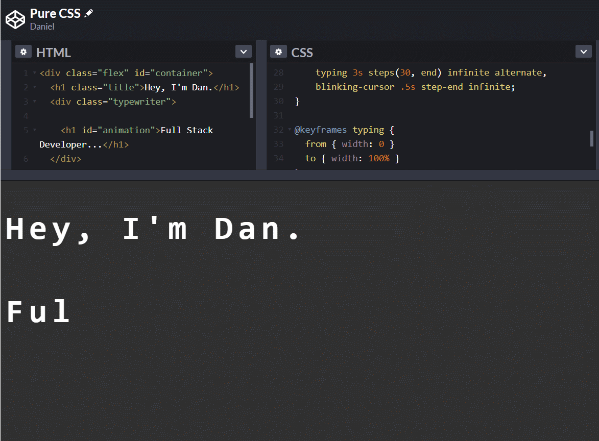
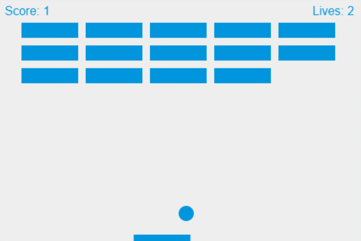
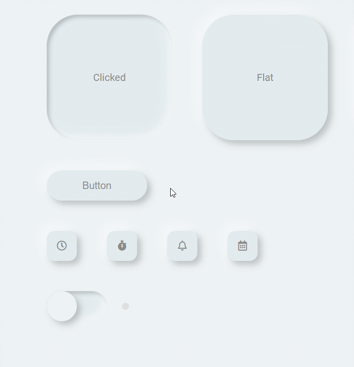

# 100 Days Of Code - Log

### Day 0: May 5, 2020
#### Trello clone project 

**Today's Progress**: Implemented most of the remaining functionality for the Trello board. 

**Thoughts:** I've really enjoyed doing this project and proud to see how far the team have taken this considering we're only week 4 into the bootcamp. I'm still trying to figure out how to fix a few lingering bugs with the `addEventListeners` being applied. 

**Link(s) to work:** 
1. ["Hrello"](https://harrietgoddard.github.io/hrello/)
2. ["Hrello" git repo](https://github.com/harrietgoddard/hrello)

**Tweet(s):**

<blockquote class="twitter-tweet">
I&#39;ve decided to use all this free time on learning something new. So committing to learning to code every day for a 100 days <a href="https://twitter.com/hashtag/100DaysOfCode?src=hash&amp;ref_src=twsrc%5Etfw">#100DaysOfCode</a>.
&mdash; Dan Norris (@danielpnorris) <a href="https://twitter.com/danielpnorris/status/1257612164778647552?ref_src=twsrc%5Etfw">May 5, 2020</a></blockquote>

### Day 1: May 6, 2020
#### GitHub Satellite

**Today's Progress**: GitHub Satellite 2020, Regex && Classes in PHP.

**Thoughts:** Okay, so I didn't get time to invest into the project today but it was a busy day. Looked at a load of new concepts for PHP and spent the remainder of the afternoon watching GitHubs virtual conference. Big takeaways: CodeQL for GitHub introduces some interesting functionality for identifying security vulnerabilities quickly, npm7 release will introduce `audit` and learn some great tips for getting involved in open source projects. 

**Link(s) to work:** 

**Tweet(s):**

<blockquote class="twitter-tweet">
For anyone interested GitHub is running a series of free virtual events today @ 12.00ET / 17.00GMT(+1). It looks really interesting, I&#39;d check it out. <a href="https://twitter.com/hashtag/Git?src=hash&amp;ref_src=twsrc%5Etfw">#Git</a> <a href="https://twitter.com/hashtag/github?src=hash&amp;ref_src=twsrc%5Etfw">#github</a> <a href="https://twitter.com/hashtag/GitHubSatellite?src=hash&amp;ref_src=twsrc%5Etfw">#GitHubSatellite</a> <a href="https://twitter.com/hashtag/100DaysOfCode?src=hash&amp;ref_src=twsrc%5Etfw">#100DaysOfCode</a> <a href="https://t.co/Wf8JOPKUi6">https://t.co/Wf8JOPKUi6</a>
&mdash; Dan Norris (@danielpnorris) <a href="https://twitter.com/danielpnorris/status/1258010285039857665?ref_src=twsrc%5Etfw">May 6, 2020</a></blockquote> 

### Day 2: May 7, 2020
#### Polymorphism

**Today's Progress**: Polymorphism in PHP 

**Thoughts:** Spent most of this afternoon getting to grips with namespaces, polymorphism and interfaces today. At face value it seems simple enough but tough to get your head around conceptually once you start digging into it. 

**Link(s) to work:** 
1. ["Polymorphism git repo"](https://github.com/daniel-norris/interfaces_php)

**Tweet(s):**

<blockquote class="twitter-tweet">
I&#39;ve been trying to get my head around OOP and Polymorphism this evening.   Need. Wine. <a href="https://twitter.com/hashtag/100DaysOfCode?src=hash&amp;ref_src=twsrc%5Etfw">#100DaysOfCode</a>
&mdash; Dan Norris (@danielpnorris) <a href="https://twitter.com/danielpnorris/status/1258505824273498114?ref_src=twsrc%5Etfw">May 7, 2020</a></blockquote> 

### Day 3: May 9, 2020
#### CSS Animation

**Today's Progress**: Looked at native CSS animation and libraries including [GSAP](www.greensock./gsap). 

**Thoughts:** Be wary of going crazy with animation. Straying too far from opacity and transform changes can have performance implications on the DOM. There's some incredible examples of very creative uses of native functionality using **Canvas** and **WebGL** including third party libraries like **Mo.js** and **GSAP**. 

**Link(s) to work:** 

**Tweet(s):**

<blockquote class="twitter-tweet">
Day 3: Looked at <a href="https://twitter.com/hashtag/CSS?src=hash&amp;ref_src=twsrc%5Etfw">#CSS</a> animations yesterday, both native and with a library called <a href="https://twitter.com/greensock?ref_src=twsrc%5Etfw">@greensock</a>. Looks like you can do some incredible things with stuff like <a href="https://twitter.com/hashtag/WebGL?src=hash&amp;ref_src=twsrc%5Etfw">#WebGL</a> and libraries like <a href="https://twitter.com/hashtag/threejs?src=hash&amp;ref_src=twsrc%5Etfw">#threejs</a>, <a href="https://twitter.com/hashtag/mojs?src=hash&amp;ref_src=twsrc%5Etfw">#mojs</a> and <a href="https://twitter.com/hashtag/snapsvg?src=hash&amp;ref_src=twsrc%5Etfw">#snapsvg</a>.  What do you prefer using? <a href="https://twitter.com/hashtag/100DaysOfCode?src=hash&amp;ref_src=twsrc%5Etfw">#100DaysOfCode</a> <a href="https://t.co/Ie8DY8jqM3">pic.twitter.com/Ie8DY8jqM3</a>
&mdash; Dan Norris (@danielpnorris) <a href="https://twitter.com/danielpnorris/status/1259532651733663744?ref_src=twsrc%5Etfw">May 10, 2020</a></blockquote> 

### Day 4: May 10, 2020
#### Game Development Using Native JS

**Today's Progress**: Looked at game development using native JS and the HTML canvas element. 

**Thoughts:** My first look at the canvas element and game development of any kind. I have a new found respect for Game Devs because even creating something so simple felt particularly involved. Still, this was a great exercise to revisit JS and have a look at canvas. 

**Link(s) to work:**   
1. [Breakout Game](https://github.com/daniel-norris/2d_canvas_game)

**Tweet(s):**

<blockquote class="twitter-tweet">
Day 4: Revisited JavaScript today had my first look at the HTML canvas element. Built an old school <a href="https://twitter.com/hashtag/atari?src=hash&amp;ref_src=twsrc%5Etfw">#atari</a> Breakout clone. The <a href="https://twitter.com/phaser_?ref_src=twsrc%5Etfw">@phaser_</a> framework looks like a good way to take this to the next level if you&#39;re interested. <a href="https://twitter.com/hashtag/100DaysOfCode?src=hash&amp;ref_src=twsrc%5Etfw">#100DaysOfCode</a> <a href="https://t.co/LUpiSItNdQ">pic.twitter.com/LUpiSItNdQ</a>
&mdash; Dan Norris (@danielpnorris) <a href="https://twitter.com/danielpnorris/status/1259535002926297088?ref_src=twsrc%5Etfw">May 10, 2020</a></blockquote> 

### Day 5: May 11, 2020
#### Game Development Using Native JS

; 

**Today's Progress**: Built on game development in native JS yesterday and looking at an infinite runner prototype with a more complex model. 

**Thoughts:** Long day today but managed to get *some* project work done. The building blocks are done here. I have a vague idea of how I could approach developing the running animation and environment movement but it needs a lot more work. 

**Link(s) to work:**   
1. ["Infinite Runner - MK1" GitHub repo](https://github.com/daniel-norris/infinite_runner); 

**Tweet(s):**

### Day 6: May 26, 2020
#### Neumorphic Design

; 

**Today's Progress**: Researched neumorphic design and started created a library for dashboard and application components. Hoping to use these for some larger projects later down the line. 

**Thoughts:** It's been a while since the last post. It's tricky juggling the bootcamp workload and finding time to blog and do side projects. Neumorphism looks interesting. There might be some accessibility issues I need to be wary of but it would be great to combine some more complex component ideas I've seen around with React. 

**Link(s) to work:**   
1. [Neumorphic Components - GitHub](https://github.com/daniel-norris/neumorphic_design); 

**Tweet(s):**
