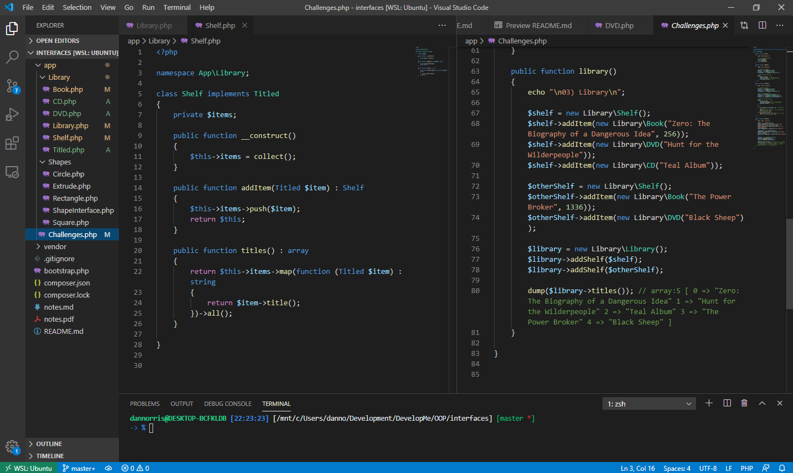
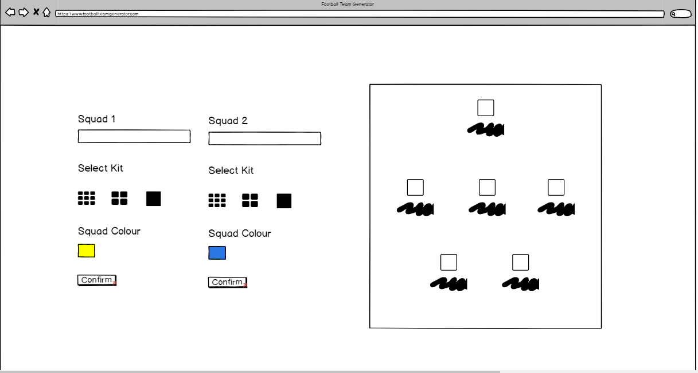
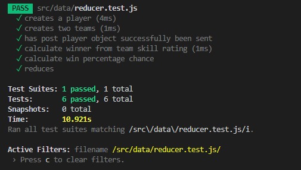

# 100 Days Of Code - Log

### Day 0: May 5, 2020
#### Trello clone project

**Today's Progress**: Implemented most of the remaining functionality for the Trello board.

**Thoughts:** I've really enjoyed doing this project and proud to see how far the team have taken this considering we're only week 4 into the bootcamp. I'm still trying to figure out how to fix a few lingering bugs with the `addEventListeners` being applied.

**Link(s) to work:**
1. ["Hrello"](https://harrietgoddard.github.io/hrello/)
2. ["Hrello" git repo](https://github.com/harrietgoddard/hrello)

**Tweet(s):**

<blockquote class="twitter-tweet">
I&#39;ve decided to use all this free time on learning something new. So committing to learning to code every day for a 100 days <a href="https://twitter.com/hashtag/100DaysOfCode?src=hash&amp;ref_src=twsrc%5Etfw">#100DaysOfCode</a>.
&mdash; Dan Norris (@danielpnorris) <a href="https://twitter.com/danielpnorris/status/1257612164778647552?ref_src=twsrc%5Etfw">May 5, 2020</a></blockquote>

### Day 1: May 6, 2020
#### GitHub Satellite

**Today's Progress**: GitHub Satellite 2020, Regex && Classes in PHP.

**Thoughts:** Okay, so I didn't get time to invest into the project today but it was a busy day. Looked at a load of new concepts for PHP and spent the remainder of the afternoon watching GitHubs virtual conference. Big takeaways: CodeQL for GitHub introduces some interesting functionality for identifying security vulnerabilities quickly, npm7 release will introduce `audit` and learn some great tips for getting involved in open source projects.

**Link(s) to work:**

**Tweet(s):**

<blockquote class="twitter-tweet">
For anyone interested GitHub is running a series of free virtual events today @ 12.00ET / 17.00GMT(+1). It looks really interesting, I&#39;d check it out. <a href="https://twitter.com/hashtag/Git?src=hash&amp;ref_src=twsrc%5Etfw">#Git</a> <a href="https://twitter.com/hashtag/github?src=hash&amp;ref_src=twsrc%5Etfw">#github</a> <a href="https://twitter.com/hashtag/GitHubSatellite?src=hash&amp;ref_src=twsrc%5Etfw">#GitHubSatellite</a> <a href="https://twitter.com/hashtag/100DaysOfCode?src=hash&amp;ref_src=twsrc%5Etfw">#100DaysOfCode</a> <a href="https://t.co/Wf8JOPKUi6">https://t.co/Wf8JOPKUi6</a>
&mdash; Dan Norris (@danielpnorris) <a href="https://twitter.com/danielpnorris/status/1258010285039857665?ref_src=twsrc%5Etfw">May 6, 2020</a></blockquote>

### Day 2: May 7, 2020
#### Polymorphism

**Today's Progress**: Polymorphism in PHP

**Thoughts:** Spent most of this afternoon getting to grips with namespaces, polymorphism and interfaces today. At face value it seems simple enough but tough to get your head around conceptually once you start digging into it.

**Link(s) to work:**
1. ["Polymorphism git repo"](https://github.com/daniel-norris/interfaces_php)

**Tweet(s):**

<blockquote class="twitter-tweet">
I&#39;ve been trying to get my head around OOP and Polymorphism this evening.   Need. Wine. <a href="https://twitter.com/hashtag/100DaysOfCode?src=hash&amp;ref_src=twsrc%5Etfw">#100DaysOfCode</a>
&mdash; Dan Norris (@danielpnorris) <a href="https://twitter.com/danielpnorris/status/1258505824273498114?ref_src=twsrc%5Etfw">May 7, 2020</a></blockquote>

### Day 3: May 9, 2020
#### CSS Animation

**Today's Progress**: Looked at native CSS animation and libraries including [GSAP](www.greensock./gsap).

**Thoughts:** Be wary of going crazy with animation. Straying too far from opacity and transform changes can have performance implications on the DOM. There's some incredible examples of very creative uses of native functionality using **Canvas** and **WebGL** including third party libraries like **Mo.js** and **GSAP**.

**Link(s) to work:**

**Tweet(s):**

<blockquote class="twitter-tweet">
Day 3: Looked at <a href="https://twitter.com/hashtag/CSS?src=hash&amp;ref_src=twsrc%5Etfw">#CSS</a> animations yesterday, both native and with a library called <a href="https://twitter.com/greensock?ref_src=twsrc%5Etfw">@greensock</a>. Looks like you can do some incredible things with stuff like <a href="https://twitter.com/hashtag/WebGL?src=hash&amp;ref_src=twsrc%5Etfw">#WebGL</a> and libraries like <a href="https://twitter.com/hashtag/threejs?src=hash&amp;ref_src=twsrc%5Etfw">#threejs</a>, <a href="https://twitter.com/hashtag/mojs?src=hash&amp;ref_src=twsrc%5Etfw">#mojs</a> and <a href="https://twitter.com/hashtag/snapsvg?src=hash&amp;ref_src=twsrc%5Etfw">#snapsvg</a>.  What do you prefer using? <a href="https://twitter.com/hashtag/100DaysOfCode?src=hash&amp;ref_src=twsrc%5Etfw">#100DaysOfCode</a> <a href="https://t.co/Ie8DY8jqM3">pic.twitter.com/Ie8DY8jqM3</a>
&mdash; Dan Norris (@danielpnorris) <a href="https://twitter.com/danielpnorris/status/1259532651733663744?ref_src=twsrc%5Etfw">May 10, 2020</a></blockquote>

### Day 4: May 10, 2020
#### Game Development Using Native JS

**Today's Progress**: Looked at game development using native JS and the HTML canvas element.

**Thoughts:** My first look at the canvas element and game development of any kind. I have a new found respect for Game Devs because even creating something so simple felt particularly involved. Still, this was a great exercise to revisit JS and have a look at canvas.

**Link(s) to work:**
1. [Breakout Game](https://github.com/daniel-norris/2d_canvas_game)

**Tweet(s):**

<blockquote class="twitter-tweet">
Day 4: Revisited JavaScript today had my first look at the HTML canvas element. Built an old school <a href="https://twitter.com/hashtag/atari?src=hash&amp;ref_src=twsrc%5Etfw">#atari</a> Breakout clone. The <a href="https://twitter.com/phaser_?ref_src=twsrc%5Etfw">@phaser_</a> framework looks like a good way to take this to the next level if you&#39;re interested. <a href="https://twitter.com/hashtag/100DaysOfCode?src=hash&amp;ref_src=twsrc%5Etfw">#100DaysOfCode</a> <a href="https://t.co/LUpiSItNdQ">pic.twitter.com/LUpiSItNdQ</a>
&mdash; Dan Norris (@danielpnorris) <a href="https://twitter.com/danielpnorris/status/1259535002926297088?ref_src=twsrc%5Etfw">May 10, 2020</a></blockquote>

### Day 5: May 11, 2020
#### Game Development Using Native JS

;

**Today's Progress**: Built on game development in native JS yesterday and looking at an infinite runner prototype with a more complex model.

**Thoughts:** Long day today but managed to get *some* project work done. The building blocks are done here. I have a vague idea of how I could approach developing the running animation and environment movement but it needs a lot more work.

**Link(s) to work:**
1. ["Infinite Runner - MK1" GitHub repo](https://github.com/daniel-norris/infinite_runner);

**Tweet(s):**

### Day 6: May 26, 2020
#### Neumorphic Design

;

**Today's Progress**: Researched neumorphic design and started created a library for dashboard and application components. Hoping to use these for some larger projects later down the line.

**Thoughts:** It's been a while since the last post. It's tricky juggling the bootcamp workload and finding time to blog and do side projects. Neumorphism looks interesting. There might be some accessibility issues I need to be wary of but it would be great to combine some more complex component ideas I've seen around with React.

**Link(s) to work:**
1. [Neumorphic Components - GitHub](https://github.com/daniel-norris/neumorphic_design);

**Tweet(s):**

### Day 7: May 27, 2020
#### Neumorphic Design

;

**Today's Progress**: Built on the neumorphic components I looked at yesterday.

**Thoughts:** The more complex the components become, the more divs that are being used which makes for terribly illegible code. Examples I've seen online showcase people developing really elegant CSS solutions using a single div and a lot of psuedo elements, SVGs and gradients. I need to look at how I can refactor these components.

**Link(s) to work:**
1. [Neumorphic Components - GitHub](https://github.com/daniel-norris/neumorphic_design);

**Tweet(s):**

<blockquote class="twitter-tweet">
D6 &amp; D7 - it&#39;s been tricky finding time for side projects but managed to have a look neumorphism and started creating some components using CSS. <a href="https://twitter.com/hashtag/100DaysOfCode?src=hash&amp;ref_src=twsrc%5Etfw">#100DaysOfCode</a> <a href="https://twitter.com/hashtag/CSS?src=hash&amp;ref_src=twsrc%5Etfw">#CSS</a> <a href="https://twitter.com/hashtag/neumorphic?src=hash&amp;ref_src=twsrc%5Etfw">#neumorphic</a> <a href="https://twitter.com/hashtag/neumorphism?src=hash&amp;ref_src=twsrc%5Etfw">#neumorphism</a> <a href="https://t.co/IumJ2iipCk">pic.twitter.com/IumJ2iipCk</a>
&mdash; Dan Norris (@danielpnorris) <a href="https://twitter.com/danielpnorris/status/1265789450921148420?ref_src=twsrc%5Etfw">May 27, 2020</a></blockquote>

### Day 8: May 28, 2020
#### React Components

;

**Today's Progress**: Built a React Single Page Application today with my own and some pre built components.

**Thoughts:** Love React. It feels very intuitive and the speed at which it feels you can go from concept to MVP is great.

**Link(s) to work:**
1. [React App - GitHub](https://github.com/daniel-norris/developme_react_app);

**Tweet(s):**

### Day 9: June 1, 2020
#### Single Div CSS

;

**Today's Progress**: Explored the limits of CSS by trying to replicate a Garmin watch using a single div as the major constraint.

**Thoughts:** This is a lot harder than it looks. Information is a little scarse and the ability to use things like `border-image`, `text-shadow` and a few other CSS properties is poorly documented anywhere. You appear to be limited to the initial sets you create for the div element or `::after` / `::before` psuedo elements so planning for this beforehand is important.

**Link(s) to work:**
1. [Single Div - GitHub](https://github.com/daniel-norris/single_div);

**Tweet(s):**

<blockquote class="twitter-tweet">
Day 9: inspired by <a href="https://twitter.com/lynnandtonic?ref_src=twsrc%5Etfw">@lynnandtonic</a>&#39;s single div project and work by <a href="https://twitter.com/ellie_html?ref_src=twsrc%5Etfw">@ellie_html</a> on here I decided to give some single div CSS design a try. Harder than it looks but pleased with the result! <a href="https://twitter.com/hashtag/100DaysOfCode?src=hash&amp;ref_src=twsrc%5Etfw">#100DaysOfCode</a> <a href="https://twitter.com/hashtag/CSS?src=hash&amp;ref_src=twsrc%5Etfw">#CSS</a> <a href="https://twitter.com/hashtag/Garmin?src=hash&amp;ref_src=twsrc%5Etfw">#Garmin</a> <a href="https://t.co/3BYtYqRWB8">https://t.co/3BYtYqRWB8</a> <a href="https://t.co/GGqDDUMBjx">pic.twitter.com/GGqDDUMBjx</a>
&mdash; Dan Norris (@danielpnorris) <a href="https://twitter.com/danielpnorris/status/1267588724105322502?ref_src=twsrc%5Etfw">June 1, 2020</a></blockquote>

### Day 10: June 2, 2020
#### Neumorphic React Library

**Today's Progress**: I've revisited my earlier CSS project and converted it into React components using the latest content we have covered on the bootcamp.

**Thoughts:** I had limited time this evening but this is a great way to independently put into practice what we are learning during the week and learning how to overcome your own problems is a fast way to learn I find. My initial aim is to try and release a small selection of components necessary to create basic apps that the other students and I can possibly use during the remainder of the course. This would also be my first ever open source contribution - which is exciting! Limited time this evening so little else to comment on retrospectively.

**Link(s) to work:**
1. [Neumorphic Components - GitHub](https://github.com/daniel-norris/neumorphic_design);

**Tweet(s):**

### Day 11: June 3, 2020
#### Neumorphic React Library

**Today's Progress**: Refactored all the CSS into SASS. Learnt a valuable lesson regarding Gulp and updated the documentation.

**Thoughts:** There hasn't been a great deal of available time again today but successfully managed to refactor all the CSS into SASS. This was a good opportunity to revisit the SASS docs and discover what functionality I could add to improve the CSS. I spent a considerable amount of time setting up Gulp task runners and watchers only to discover that I didn't need to convert the SCSS to CSS in React! I'm updating the documentation using Markdown as an interim solution but would really like to publish the library with professional looking docs and code snippets.

**Link(s) to work:**
1. [Neumorphic Components - GitHub](https://github.com/daniel-norris/neumorphic_design);

**Tweet(s):**

### Day 12: June 4, 2020
#### Neumorphic React Library

**Today's Progress**:   Starting creating bespoke form components.

**Thoughts:** Wow. I didn't previously realise how involved styling form inputs were to ensure that they were cross-browser compatible and semantically hitting the mark. The good news? The terrible markdown I had been previously using has all been reduced to clean semantic HTML. The bad news? I'm not at this moment sure what the best way is to ensure that I am aware of changes made to support, e.g. if (moz, webkit or ms) prefix support is deprecated and how I will maintain the library.

**Link(s) to work:**
1. [Neumorphic Components - GitHub](https://github.com/daniel-norris/neumorphic_design);

**Tweet(s):**

### Day 13: June 7, 2020
#### Neumorphic React Library

;

**Today's Progress**: Completed all of the form components.

**Thoughts:** Big push today. The form elements are all done now. I need to add a few more components for layout and probably validation but I think we're nearly there for release v 0.1.0. ( ...maybe). I've decided to push some of the original components like the dial to a later release that perhaps includes an "analog" set of components. The circular progress bar looks like it will need a SVG path to animate and it's just going to take up too much time at this stage. I need to look at what other requirements I need to publish this as an open source library on npm.

**Link(s) to work:**
1. [Neumorphic Components - GitHub](https://github.com/daniel-norris/neumorphic_design);

**Tweet(s):**

### Day 14: June 10, 2020
#### Laravel API

**Today's Progress**: Started on an API for a side project using Laravel and Homestead.

**Thoughts:** Taken a bit of a detour today. We have our final project week coming up next week and I wanted to revisit Laravel and have started on an API for a app idea I've wanted to implement which focuses on enabling rock climbers to improve performance over time.

**Link(s) to work:**
1. [Climbing API - GitHub](https://github.com/daniel-norris/climbing_app_api);

**Tweet(s):**

### Day 15: June 11, 2020
#### React Component Library

**Today's Progress**: Preparing the library for publishing to npm.

**Thoughts:** I seem to be running into a whole lot of challenges I wasnt expecting while preparing the library for publishing to npm. A lot of issues centre around bundling certain dependencies. I've been looking at a lot of different potential solutions including rollup.js, parcel and bespoke webpack configs. What am I missing here?.

**Link(s) to work:**
1. [Neu UI - GitHub](https://github.com/daniel-norris/neu_ui);

**Tweet(s):**

### Day 16: June 14, 2020
#### React Library Style Guide

;

**Today's Progress**: Setting up a style guide using Storybook for the library.

**Thoughts:** From what I've read and to some small extent my own experience, getting users to adopt a new library largely depends on how good the documentation is. So, I've looked around and there's a couple good options, e.g. Styleguidist, bit.dev and Storybook. I'm going with Storybook!

**Link(s) to work:**
1. [Neu UI Style Guide - GitHub](https://github.com/daniel-norris/neu_ui_docs);

**Tweet(s):**

### Day 17: June 21, 2020
#### App Planning

;

**Today's Progress**: Planning the development of a new full stack app.

**Thoughts:** Okay, so this one doesn't 'technically' count as a coding day but it's relevant. I've spent a lot of this afternoon writing out user stories, Balsamiq wireframes, API end points and database tables for a new football app. The aim is for it to enable the user to choose a team of premiership players from a 3rd party API and then provide the user the opportunity to randomise their roster into two teams and then predict a winner based off data, e.g. scoring, assist or save average.

**Link(s) to work:**
1. [Football App - GitHub](https://github.com/daniel-norris/football_app);
2. [Planning Docs - Confluence](https://dannorris.atlassian.net/wiki/spaces/~724717840/pages/196611/FooDraft);

**Tweet(s):**

### Day 18: June 22, 2020
#### App Development

;

**Today's Progress**: Rolled back some of the earlier plan and started development today.

**Thoughts:** After sleeping on it, I've decided to roll back some of the earlier features with concerns over time and database complexity. I want to have this done by next week to show to potential employers. So, I'm dropping the third party API and just providing the user the opportunity to name players and teams themselves. This enables me to avoid creating multiple tables with many to many relationships. Starting on the RESTful API in Laravel today!

**Link(s) to work:**
1. [Football API - GitHub](https://github.com/daniel-norris/football_api);
2. [Planning Docs - Confluence](https://dannorris.atlassian.net/wiki/spaces/~724717840/pages/196611/FooDraft);

**Tweet(s):**

### Day 19: June 23, 2020
#### App Development

;

**Today's Progress**: Created most of the API routes today and added unit testing.

**Thoughts:** API routes are mostly done now. I've also set up requests and resources to validate and change how the data is served by the API. Initial unit tests are complete too. There's something oddly satisfying about getting all green passes on your unit tests.

**Link(s) to work:**
1. [Football API - GitHub](https://github.com/daniel-norris/football_api);
2. [Planning Docs - Confluence](https://dannorris.atlassian.net/wiki/spaces/~724717840/pages/196611/FooDraft);

**Tweet(s):**

### Day 20: June 24, 2020
#### App Development

;

**Today's Progress**: Implemented shuffle logic and completed MVP today.

**Thoughts:** I've swapped over to the front end using React and Redux and implemented the shuffle logic using the Fisher-Yates algorithm. Also implemented unit testing.

**Link(s) to work:**
1. [Football App - GitHub](https://github.com/daniel-norris/football_app);
2. [Planning Docs - Confluence](https://dannorris.atlassian.net/wiki/spaces/~724717840/pages/196611/FooDraft);

**Tweet(s):**

### Day 21: June 25, 2020
#### App Development

**Today's Progress**: Implemented new features today on the front end.

**Thoughts:** Now the MVP is there, I've started looking at new features to implement. I've created iterable markers on a field which provides the user with better UX. I've also included a final view page for the app which enables the user to view their randomised team both in a list and on the field.

**Link(s) to work:**
1. [Football App - GitHub](https://github.com/daniel-norris/football_app);
2. [Planning Docs - Confluence](https://dannorris.atlassian.net/wiki/spaces/~724717840/pages/196611/FooDraft);

**Tweet(s):**

### Day 22: June 26, 2020
#### App Development

**Today's Progress**: Implemented a predict winner feature and client side validation.

**Thoughts:** The app now calculates the percentage change of each team winning based on an aggregate value of the skill ratings. All the forms now have appropriate client side validation and user feedback.

**Link(s) to work:**
1. [Football App - GitHub](https://github.com/daniel-norris/football_app);
2. [Planning Docs - Confluence](https://dannorris.atlassian.net/wiki/spaces/~724717840/pages/196611/FooDraft);

**Tweet(s):**

### Day 23: June 27, 2020
#### App Development

;

**Today's Progress**: Preparing the app for deployment.

**Thoughts:** I had some issues today preparing the app for deployment. Initially issues with the server and composer.json version of PHP stopping a composer install on the server. Then later a HTTPS issue which could only be solved by purchasing a domain. Then, time spent pointing the domain using AWS's Route 53 and Elastic IP to the EC2 instance. I started looking at Heroku as an alternative but perseverance paid off.

**Link(s) to work:**
1. [Football App - GitHub](https://github.com/daniel-norris/football_app);
2. [Planning Docs - Confluence](https://dannorris.atlassian.net/wiki/spaces/~724717840/pages/196611/FooDraft);

**Tweet(s):**

### Day 24: June 28, 2020
#### App Development

**Today's Progress**: Deployed!

**Thoughts:** Fixed some final bits and pieces. Using Lighthouse to check its passing accessibility and fixed some issues affecting performance. The site is now responsive too.

**Link(s) to work:**
1. [Football App - GitHub](https://github.com/daniel-norris/football_app);
2. [Planning Docs - Confluence](https://dannorris.atlassian.net/wiki/spaces/~724717840/pages/196611/FooDraft);

**Tweet(s):**

